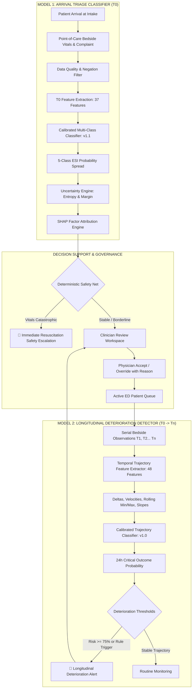

# PatientTriage.ai

### AI-Powered Emergency Department Triage & Clinical Decision Support

[](https://fastapi.tiangolo.com)
[](https://react.dev/)
[](https://vitejs.dev/)
[](https://scikit-learn.org/)
[](https://tailwindcss.com/)
[]()

---

> [!CAUTION]
> **Advisory Clinical Decision Support Prototype Notice**
> **PatientTriage.ai is an experimental clinical decision-support (CDS) prototype developed for technical demonstration and research evaluation.**
> It does **NOT** provide autonomous medical diagnoses, definitive triage assignments, or independent medical treatments. The software does not replace the professional clinical judgment, physical examination, or diagnostic decisions of licensed emergency physicians, triage nurses, or certified healthcare personnel. All AI recommendations are advisory and subject to mandatory human-in-the-loop review.

---

## Table of Contents

- [1. Project Overview](#1-project-overview)
- [2. Problem Statement](#2-problem-statement)
- [3. Key Objectives](#3-key-objectives)
- [4. Key Features](#4-key-features)
- [5. AI/ML Architecture](#5-aiml-architecture)
- [6. ML Pipeline](#6-ml-pipeline)
- [7. Feature Engineering](#7-feature-engineering)
- [8. Dataset](#8-dataset)
- [9. Model Performance](#9-model-performance)
- [10. Explainability](#10-explainability)
- [11. Uncertainty & Safety](#11-uncertainty--safety)
- [12. ED Workflow](#12-ed-workflow)
- [13. Surge Workflow](#13-surge-workflow)
- [14. Hospital Scalability](#14-hospital-scalability)
- [15. Patient Data Privacy & Security](#15-patient-data-privacy--security)
- [16. Technology Stack](#16-technology-stack)
- [17. Project Structure](#17-project-structure)
- [18. Installation](#18-installation)
- [19. Environment Variables](#19-environment-variables)
- [20. Running the Application](#20-running-the-application)
- [21. Demo Scenario](#21-demo-scenario)
- [22. Simulated Data Disclaimer](#22-simulated-data-disclaimer)
- [23. Testing](#23-testing)
- [24. Limitations](#24-limitations)
- [25. Future Work](#25-future-work)
- [26. Contribution / Development Notes](#26-contribution--development-notes)
- [27. License](#27-license)

---

## 1. Project Overview

**PatientTriage.ai** is an emergency department clinical decision-support and continuous physiological deterioration monitoring system. Designed for high-acuity, resource-constrained hospital emergency rooms, the platform assists triage nurses and emergency physicians during intake, waiting room observation, and care space allocation.

Modern emergency departments face severe overcrowding, volatile surge surges, and variable clinical presentations. PatientTriage.ai addresses these operational bottlenecks by pairing calibrated machine learning models with clinical safety interlocks. Upon patient arrival ($T_0$), the system calculates predicted 5-level Emergency Severity Index (ESI) probability distributions, extracts point-of-care vital biomarkers, quantifies predictive uncertainty, and surfaces explainable factor attributions (SHAP).

While patients remain in the emergency department, the platform continuously monitors serial vital signs ($T_0 \to T_1 \to \dots \to T_n$). A dedicated longitudinal deterioration model identifies early physiological decompensation—such as occult sepsis, silent hypoxemia, or widening shock index—triggering automated clinical alerts before catastrophic collapse. Real-time hospital capacity tracking automatically places patients into available care spaces and distinguishes genuine bed saturation from routine clinical delays.

The platform enforces strict human-in-the-loop clinical governance: authorized clinicians can accept or override AI recommendations with mandatory clinical justification, and every recommendation, override, alert resolution, and status transition is recorded in an immutable, tamper-evident audit trail.

---

## 2. Problem Statement

Emergency departments operate under conditions of extreme operational stress and informational uncertainty:

1. **High Patient Volume & Resource Scarcity**: Emergency rooms frequently exceed physical bed capacity and available staffing ratios, leading to prolonged waiting times and delayed clinical evaluation.
2. **Heterogeneous Clinical Presentations**: Presenting complaints range from minor musculoskeletal trauma to life-threatening acute coronary syndromes and decompensated sepsis, often presenting with overlapping or misleading vital signs.
3. **Incomplete Intake Data**: At point-of-arrival triage, nurses must make rapid classification decisions in under two minutes with incomplete medical histories, missing vital parameters, or first-time unregistered patients.
4. **Ambiguous & Discordant Presentations**: Patients may report severe subjective pain despite normal baseline vitals, or conversely, geriatric patients with blunted febrile and cardiac responses may present with vague malaise while experiencing severe occult shock.
5. **Age-Dependent Physiology**: Pediatric and geriatric vital signs differ significantly from standard adult baselines; applying uniform diagnostic thresholds risks catastrophic under-triage in vulnerable age cohorts.
6. **Waiting Room Deterioration**: A significant proportion of adverse emergency outcomes occur after intake while patients wait unattended in waiting rooms, suffering silent physiological collapse.
7. **Clinician Accountability & Overcrowding**: High cognitive loads increase diagnostic variability. Clinicians require fast, transparent decision support that preserves professional autonomy and maintains transparent auditability across hospital operational scales.

---

## 3. Key Objectives

- **AI-Assisted Arrival Triage**: Deliver instant, calibrated 5-level ESI probability distributions at point of intake ($T_0$) to reduce triage variability.
- **Safety-First Acuity Escalation**: Prevent fatal under-triage through deterministic clinical safety interlocks and asymmetric loss penalties.
- **Explicit Uncertainty Quantification**: Distinguish high-confidence predictions from uncertain predictions caused by decision boundary proximity or data missingness.
- **Explainable Clinical Predictions**: Provide transparent, point-of-care SHAP factor attributions explaining why specific risk levels were recommended.
- **Continuous Deterioration Monitoring**: Evaluate repeated bedside observations to detect adverse longitudinal vital trajectories before clinical collapse.
- **Capacity-Aware ED Operations**: Automatically map active encounters to hospital bed zones (Resuscitation, ICU, Acute, Fast Track) and indicate waiting states only when capacity is genuinely saturated.
- **Clinician-in-the-Loop Governance**: Guarantee that AI recommendations remain purely advisory, giving attending physicians full override authority.
- **Tamper-Resistant Audit Trail**: Maintain an immutable chronological record of every clinical assessment, override, alert lifecycle change, and system event.
- **Surge-Resilient Workflow**: Maintain safe patient queue visibility and alert responsiveness during simulated $3\times$ volume surges without downgrading triage acuity.
- **Configurable Hospital Scalability**: Support small community facilities, regional suburban emergency rooms, and large trauma centers with scalable bed profiles.

---

## 4. Key Features

```
┌────────────────────────────────────────────────────────────────────────────────────────┐
│                               PATIENTTRIAGE.AI PLATFORM                                │
├─────────────────────────┬─────────────────────────┬────────────────────────────────────┤
│  Point-of-Care Intake   │  Predictive Intelligence │   Capacity & Governance            │
│  • Rapid Registration   │  • Calibrated ESI ML    │   • Acuity-Aware Bed Allocation    │
│  • Bedside Vitals Entry │  • Trajectory Alerts    │   • Clinician Override Workspace   │
│  • Negation Extraction  │  • SHAP Explainability  │   • Tamper-Evident Audit Logging   │
│  • Age Cohort Grouping  │  • Multi-Tier Confidence│   • 3× ED Surge Simulation         │
└─────────────────────────┴─────────────────────────┴────────────────────────────────────┘
```

### A. Patient Intake
- **Demographics & Identification**: Captures patient name, age, gender, arrival mode (Ambulance, Walk-in, Wheelchair), and automatically generates facility-scoped Medical Record Numbers (MRN) and Encounter IDs.
- **Chief Complaint & Clinical Negation**: Parses presenting complaints and medical history while filtering clinical negations (e.g., *"denies chest pain"*, *"no dyspnea"*), preventing negated symptoms from inflating cardiac or respiratory acuity.
- **Bedside Vital Signs Entry**: Accepts Heart Rate (HR), Systolic Blood Pressure (SBP), Diastolic Blood Pressure (DBP), Respiratory Rate (RR), Oxygen Saturation ($\text{SpO}_2$), Body Temperature, Glasgow Coma Scale (GCS), and Pain Score (0–10).
- **History & Allergies Classification**: Categorizes history availability into *History Available*, *Partial History*, or *Zero History / First Visit*, ensuring missing history is never falsely assumed to indicate a healthy baseline.

### B. AI/ML Triage
- **Calibrated Multi-Class Probability**: Computes discrete probability vectors $[P(\text{ESI}_1), P(\text{ESI}_2), P(\text{ESI}_3), P(\text{ESI}_4), P(\text{ESI}_5)]$ strictly summing to $1.0$.
- **Acuity Stratification**: Maps probabilistic risk to standard Emergency Severity Index categories:
  - **ESI 1**: *Critical — Immediate Care (Resuscitation)*
  - **ESI 2**: *Emergency — Immediate Assessment*
  - **ESI 3**: *Urgent — Prompt Assessment*
  - **ESI 4**: *Less Urgent*
  - **ESI 5**: *Non-Urgent*
- **Biomarker Derivation**: Calculates Shock Index ($\text{HR}/\text{SBP}$), Modified Shock Index, Pulse Pressure ($\text{SBP} - \text{DBP}$), Mean Arterial Pressure (MAP), quick Sequential Organ Failure Assessment (qSOFA), and Modified Early Warning Score (MEWS).
- **Uncertainty Tiers**: Grades predictions into **HIGH**, **MODERATE**, or **LOW** confidence based on normalized Shannon entropy, boundary margin, and feature missingness.
- **Explainability Drawer**: Displays top physiological positive and negative contributors directly within the dashboard card.

### C. ED Active Queue
- **Acuity-Sorted Queue**: Displays all active emergency department patients ordered by clinical severity, physiological deterioration risk, and elapsed waiting time.
- **Filter Tabs**: Instant filtering by *All Active*, *Waiting*, *In Care*, *Reassessment Required*, *High Priority (ESI 1-2)*, *Critical (ESI 1)*, and *Discharged*.
- **Safe Wait-Time Tracking**: Tracks elapsed waiting time against protocolized ESI maximum safe thresholds (ESI 1: 0m, ESI 2: 15m, ESI 3: 45m, ESI 4: 90m, ESI 5: 120m).
- **Automated Reassessment Triggers**: Visual amber alert prompts when a patient's wait duration exceeds their acuity threshold.

### D. Clinician Override
- **Advisory AI Model**: AI recommendations are clearly marked as clinical guidance; they do not dictate care.
- **Physician Review Workspace**: Dedicated interface for attending physicians (`DOC001`) to review intake data, AI probability spreads, SHAP attributions, and enter clinical decisions.
- **Immutable Override Preservation**: When a clinician changes a triage level (e.g., ESI 2 to ESI 3), the original AI recommendation is immutably preserved alongside the clinician's assigned level and mandatory documented justification.

### E. Patient Lifecycle
- **Workflow Progression**:
  $$\text{Arrival Intake} \longrightarrow \text{Care Space Allocation (In Care)} \longrightarrow \text{Clinical Treatment} \longrightarrow \text{Discharge / Transfer}$$
- **Discharge Mechanics**: Discharging a patient releases their assigned bed, resolves open active alerts, and removes them from the active queue while retaining all clinical records and audit logs for medical record compliance.

### F. Capacity Management
- **Structured Bed Zones**: Standardized bed layout reflecting real hospital departments:
  - **Resuscitation Bays (`RESUS-01`, `RESUS-02`)**: Equipped for ESI 1 resuscitation.
  - **Critical Care / ICU Bays (`ICU-01`, `ICU-02`)**: ESI 2 emergent and deteriorating cases.
  - **Acute Care Beds (`BED-01` to `BED-17`)**: ESI 2–4 urgent presentations.
  - **Fast Track Chairs/Beds (`FT-01` to `FT-04`)**: ESI 4–5 low-acuity presentations.
- **Acuity-Aware Auto-Assignment**: When beds are available, active patients are automatically allocated appropriate beds and placed in `IN_TREATMENT` (**"IN CARE"**).
- **Capacity-Saturated Waiting**: Patients only enter the `WAITING` state (`"WAITING FOR AVAILABLE CARE SPACE"`) when 100% of configured beds are occupied.
- **Bed Turnover**: Discharging an in-bed patient instantly admits the highest-priority waiting patient into the newly freed care space.

### G. Surge Mode Operations
- **Simulated 3× Volume Influx**: Simulates disaster or multi-casualty incidents by tripling expected arrival rates.
- **Surge Queue Prioritization**: Automatically surfaces unstable (`ESCALATE`) and overdue (`REASSESS`) patients to the top of the queue.
- **Zero Silent Downgrading**: Enforces that clinical acuity is never reduced to create artificial capacity during surge conditions.

### H. Audit & Governance
- **Tamper-Evident Chronological Logs**: Every intake, vital entry, vital correction, AI inference, alert generation, alert resolution, physician review, override, and discharge produces a cryptographically identified audit log entry.
- **Zero PII Exposure**: Audit log metadata sanitizes passwords, session tokens, and unnecessary personal identifiers.
- **Role-Based Audit Access**: Restricted to authorized clinical directors and hospital administrators.

### I. Role-Based Access Control (RBAC) & Security
- **Multi-Tenant Facility Isolation**: Strict database-level isolation ensuring staff from Hospital A (`DEMO001`) can never access records or encounters from Hospital B (`METRO002`).
- **5 Staff Roles**:
  - `HOSPITAL_ADMIN`: Facility configuration, staff provisioning, audit inspection.
  - `CLINICAL_DIRECTOR`: Clinical policy, surge mode activation, protocol monitoring.
  - `EMERGENCY_PHYSICIAN`: Clinical review workspace, diagnostic orders, AI overrides, patient discharge.
  - `TRIAGE_NURSE`: Patient intake, bedside vital entry, observation corrections, alert acknowledgment.
  - `EMERGENCY_TECHNICIAN`: Vital signs capture, patient transport, supportive care.
- **Password Security**: PBKDF2-HMAC-SHA256 password hashing with 100,000 iterations and cryptographic salts.
- **Brute Force Protection**: Sliding-window rate limiter blocking IP/staff accounts exceeding 5 failed login attempts per minute (HTTP 429).

---

## 5. AI/ML Architecture

PatientTriage.ai implements two distinct machine learning models operating at different temporal stages of the emergency workflow:



### Model Distinction Summary

| Attribute | Model 1: Arrival Triage Classifier | Model 2: Longitudinal Deterioration Model |
| :--- | :--- | :--- |
| **Temporal Anchor** | Point of Arrival ($T_0$ only) | Sequential Observations ($T_0 \to T_1 \to \dots \to T_n$) |
| **Input Features** | 37 Intake Features (Vitals, Negated Complaint, Demographics) | 48 Temporal Features (Deltas, Velocities, Slopes, Shock Index) |
| **Prediction Target** | 5-Level ESI Acuity ($P(\text{ESI}_1) \dots P(\text{ESI}_5)$) | 24-Hour Composite Critical Outcome (ICU, Death, Intubation) |
| **Model Engine** | Calibrated Multi-Class Classifier (v1.1) | Calibrated Logistic Regression with Sigmoid Scaling (v1.0) |
| **Safety Net** | Deterministic Vitals Interlocks (Catastrophic vitals $\to$ ESI 1) | Severe Shock Index ($\ge 1.3$) & Rapid $\text{SpO}_2$ Desaturation Alert |

---

## 6. ML Pipeline

The repository contains an end-to-end clinical machine learning engineering pipeline in [`ml_pipeline/`](file:///c:/Users/aksha/Downloads/PatientTriage-AI/ml_pipeline):

```
ml_pipeline/
├── data_quality_engine.py           # Vitals range validation, missingness tracking, negation
├── age_reference_provider.py        # Pediatric, adult, and geriatric vital reference ranges
├── arrival_feature_extractor.py     # 37-dimensional T0 arrival feature vector builder
├── arrival_preprocessor.py          # Scaling, imputation, and categorical encoding
├── train_arrival_triage_model.py    # Training, hyperparameter tuning, and probability calibration
├── arrival_inference_engine.py      # Production inference wrapper with confidence & uncertainty
├── longitudinal_feature_extractor.py# 48-dimensional temporal trajectory feature builder
├── train_longitudinal_deterioration_model.py # Longitudinal model training pipeline
├── deterioration_inference_engine.py# Trajectory inference engine for serial vitals
├── explainability_engine.py         # SHAP Tree/Linear feature attribution calculation
└── mlops_service.py                 # Model registry, data drift tracking, and dataset versioning
```

### Pipeline Lifecycle
1. **Data Ingestion & Quality Validation** ([`data_quality_engine.py`](file:///c:/Users/aksha/Downloads/PatientTriage-AI/ml_pipeline/data_quality_engine.py)): Validates biological plausibility of vital signs (e.g., rejects $\text{SpO}_2 > 100\%$, $\text{HR} > 300$). Imputes missing values while generating boolean missingness indicator flags.
2. **Clinical Text Negation Filtering**: Uses clinical syntax rules to separate affirmed symptoms from negated symptoms (*"denies fever"*, *"no chest pain"*).
3. **Anti-Leakage Group Partitioning**: Cohorts are strictly partitioned by `patient_id` (70% Train, 15% Validation, 15% Test) ensuring zero patient overlap across splits. Future clinical outcomes, discharge times, and post-triage interventions are strictly quarantined.
4. **Probability Calibration**: Uses `CalibratedClassifierCV(method="sigmoid", cv=5)` to guarantee that output probabilities accurately reflect true empirical risk.
5. **Model Artifact Versioning**: Models are serialized as `.joblib` artifacts alongside companion JSON metadata documents detailing feature order, training hyperparameters, and validation metrics.

---

## 7. Feature Engineering

### Currently Implemented Features

#### Model 1: Arrival Triage Classifier ($T_0$ — 37 Features)
- **Demographics (6)**: `age`, `age_pediatric` ($<18$), `age_adult` ($18-64$), `age_geriatric` ($\ge 65$), `gender_male`, `gender_female`.
- **Arrival Mode (4)**: `arrival_mode_walkin`, `arrival_mode_ambulance`, `arrival_mode_wheelchair`, `arrival_mode_other`.
- **Chief Complaint Categories with Negation (7)**: `complaint_chest_pain`, `complaint_respiratory`, `complaint_abdominal`, `complaint_neurological`, `complaint_trauma`, `complaint_infection_fever`, `complaint_other`.
- **Bedside Vital Signs (8)**: `hr`, `sbp`, `dbp`, `rr`, `spo2`, `temp`, `gcs`, `pain_score`.
- **Derived Physiological Biomarkers (5)**: `shock_index`, `modified_shock_index`, `pulse_pressure`, `qsofa_score`, `mews_score`.
- **Missingness Indicator Flags (4)**: `temp_was_missing`, `gcs_was_missing`, `dbp_was_missing`, `pain_was_missing`.
- **History & Allergy Flags (3)**: `has_known_history`, `is_zero_history`, `has_known_allergies`.

#### Model 2: Longitudinal Deterioration Model ($T_0 \to T_n$ — 48 Features)
- **Current Vitals ($T_n$)**: `hr`, `sbp`, `dbp`, `rr`, `spo2`, `temp`, `gcs`, `pain_score`.
- **Current Biomarkers ($T_n$)**: `shock_index`, `modified_shock_index`, `pulse_pressure`, `mean_arterial_pressure`, `qsofa_score`, `mews_score`.
- **Sequential 1-Step Deltas ($T_n - T_{n-1}$)**: `delta_hr`, `delta_spo2`, `delta_rr`, `delta_sbp`, `delta_dbp`, `delta_temp`, `delta_gcs`, `delta_shock_index`.
- **Per-Minute Rates of Change (Velocities)**: `velocity_hr`, `velocity_spo2`, `velocity_rr`, `velocity_sbp`, `velocity_shock_index`.
- **Cumulative Baseline Deltas ($T_n - T_0$)**: `baseline_hr_delta`, `baseline_spo2_delta`, `baseline_rr_delta`, `baseline_sbp_delta`.
- **Rolling Trajectory Statistics**: `rolling_min_spo2`, `rolling_max_hr`, `rolling_max_rr`, `rolling_min_sbp`, `rolling_mean_hr`, `rolling_mean_spo2`.
- **Trajectory Slopes**: `trajectory_slope_spo2`, `trajectory_slope_hr`, `trajectory_slope_rr`.
- **Operational Context**: `observation_count`, `time_since_arrival_mins`, `minutes_since_prior_obs`, `initial_triage_level`, `is_pediatric`, `is_geriatric`, `age`, `gender_male`.

### Planned / Future Features
- *Unstructured Clinical Notes Embeddings*: Dense vector representations extracted via ClinicalBERT / BioLinkBERT.
- *Point-of-Care Laboratory Biomarkers*: High-sensitivity Troponin-I, venous blood lactate, blood gas analysis ($\text{pH}$, $\text{pCO}_2$), and creatinine.
- *Continuous Waveform Photoplethysmography (PPG)*: Pulse rate variability and respiratory sinus arrhythmia telemetry.

---

## 8. Dataset

The system was developed and benchmarked using clinically calibrated synthetic patient cohorts generated to model real-world emergency distributions:

| Dataset Partition | Filename | Records / Cohort Size | Clinical Target |
| :--- | :--- | :--- | :--- |
| **Arrival Triage (Train)** | `dataset_arrival_v1.0_train.csv` | 3,500 unique patients | 5-Level ESI Acuity (`1` to `5`) |
| **Arrival Triage (Validation)** | `dataset_arrival_v1.0_val.csv` | 750 unique patients | 5-Level ESI Acuity (`1` to `5`) |
| **Arrival Triage (Test)** | `dataset_arrival_v1.0_test.csv` | 750 unique patients | 5-Level ESI Acuity (`1` to `5`) |
| **Longitudinal Trajectory (All)** | `dataset_longitudinal_v1.0.csv` | 15,749 observation slices (4,500 patients) | Composite 24h Critical Outcome |
| **Demonstration Archetypes** | Synthetic Seeder (`/api/demo/seed`) | 20 Archetype Encounters | Clinical Challenge Scenarios |

> [!NOTE]
> **Data Grounding Disclosure**:
> The current prototype uses simulated development data generated to reflect plausible physiological and clinical distributions. Performance metrics reported below reflect development testing on this simulated cohort and **must not be construed as prospective clinical validation**.

---

## 9. Model Performance

*All metrics reported below are verified directly from model evaluation artifacts in [`ml_pipeline/models/`](file:///c:/Users/aksha/Downloads/PatientTriage-AI/ml_pipeline/models).*

### Model 1: Arrival Triage Classifier (Held-Out Test Set, $N = 750$)
*Artifact: `ml_pipeline/models/arrival_triage/evaluation_metrics_v1.0.json`*

- **Test Accuracy**: **78.40%**
- **Under-Triage Rate (UTR)**: **2.00%** *(Critical safety metric: patients assigned lower acuity than true need)*
- **Severe Under-Triage Rate ($\ge 2$ levels)**: **0.67%**
- **Over-Triage Rate (OTR)**: **19.60%** *(Safe clinical conservatism)*
- **Multi-Class Brier Score**: **0.2977**
- **Per-Class Sensitivity (Recall)**:
  - **ESI 1 (Resuscitation)**: **91.38%**
  - **ESI 3 (Urgent)**: **98.21%**
  - **ESI 4 (Less Urgent)**: **100.00%**

### Model 2: Longitudinal Deterioration Model (Held-Out Test Set, $N = 2,388$ observation slices)
*Artifact: `ml_pipeline/models/deterioration/evaluation_metrics_v1.0.json`*

- **ROC-AUC**: **0.8847**
- **PR-AUC (Average Precision)**: **0.7985**
- **Sensitivity / Recall**: **81.49%**
- **Precision**: **81.65%**
- **False Negative Rate (FNR)**: **18.51%**
- **Brier Score (Calibration)**: **0.1255**
- **Accuracy**: **84.09%**
- **Subgroup Sensitivity**:
  - Pediatric ($<18$ yrs): **96.15%** (ROC-AUC: 0.8066)
  - Geriatric ($\ge 65$ yrs): **85.99%** (ROC-AUC: 0.9076)
  - Adult ($18-64$ yrs): **79.85%** (ROC-AUC: 0.8808)

---

## 10. Explainability

PatientTriage.ai integrates **SHAP (SHapley Additive exPlanations)** via [`explainability_engine.py`](file:///c:/Users/aksha/Downloads/PatientTriage-AI/ml_pipeline/explainability_engine.py) to provide point-of-care interpretability:

```
               AI PREDICTED ACUITY: ESI 1 (CRITICAL)
               Confidence: HIGH (97%) · Entropy: 0.03
                                 │
         ┌───────────────────────┴───────────────────────┐
         ▼                                               ▼
[+ PUSHING TOWARD CRITICAL]                    [- PUSHING TOWARD STABLE]
• Shock Index = 1.48 (+0.41)                   • Age = 73 (Geriatric Baseline)
• SpO2 = 88% (+0.38)                           • Ambulatory Status (-0.05)
• SBP = 88 mmHg (+0.29)
• Respiratory Rate = 28 bpm (+0.22)
                                 │
                                 ▼
                     CLINICIAN EVALUATION WORKSPACE
               [Accept Priority]   [Override Priority]
```

> [!IMPORTANT]
> **Clinical Association vs. Causality**:
> SHAP values indicate the statistical association and feature weight utilized by the mathematical model to generate the probability distribution. They represent **correlation within the model's feature space**, not biological causality.

---

## 11. Uncertainty & Safety

PatientTriage.ai implements a **Safety-First** uncertainty architecture ([`uncertainty_service.py`](file:///c:/Users/aksha/Downloads/PatientTriage-AI/backend/services/uncertainty_service.py) & [`safety_service.py`](file:///c:/Users/aksha/Downloads/PatientTriage-AI/backend/services/safety_service.py)):

1. **Normalized Entropy Calculation**: Quantifies dispersion across the 5 class probabilities:
   $$H(P) = -\sum_{i=1}^5 p_i \log_5(p_i)$$
2. **Decision Margin**: Measures distance between the top predicted class and second-highest class ($p_{(1)} - p_{(2)}$).
3. **Missingness Penalty**: Adjusts confidence downward when essential bedside vitals are missing or imputed.
4. **Safety Escalation Trigger**: When confidence is **LOW** ($H \ge 0.60$ or margin $< 0.15$), the system automatically triggers a **Safety-First Escalation**, promoting the patient to a higher monitoring category until reviewed by a physician.
5. **Deterministic Clinical Interlocks**: Any vital sign reflecting immediate life-threat ($\text{SpO}_2 < 85\%$, $\text{SBP} < 70\text{ mmHg}$, $\text{GCS} \le 8$, or $\text{Shock Index} \ge 1.3$) immediately forces an ESI 1 resuscitation recommendation regardless of model probability.

---

## 12. ED Workflow


---

## 13. Surge Workflow

PatientTriage.ai includes a protocolized Emergency Surge Simulator ([`hospital_config_service.py`](file:///c:/Users/aksha/Downloads/PatientTriage-AI/backend/services/hospital_config_service.py)):

| Operational State | Normal Mode | Surge Mode ($3\times$ Influx) |
| :--- | :--- | :--- |
| **Arrival Rate** | Baseline Volume (e.g., 25/day) | $3.0\times$ Volume (e.g., 75/day) |
| **Queue Prioritization** | Standard Acuity + Arrival Time | Dynamic Surge Re-indexing (`ESCALATE` & `REASSESS` elevated) |
| **Safe Wait Thresholds** | Standard (ESI 2: 15m, ESI 3: 45m) | Tightened by 20% to prevent unobserved waiting room collapse |
| **Fast Track Protocols** | Routine | Priority fast-tracking for ESI 4–5 to preserve acute care beds |
| **Triage Acuity Rule** | Fixed | **Strict Preservation: Zero artificial down-triaging permitted** |

---

## 14. Hospital Scalability

The system includes pre-configured hospital operational scale profiles:

```
┌─────────────────────────┬─────────────────────────┬─────────────────────────┐
│   SMALL COMMUNITY ED    │   MEDIUM SUBURBAN ED    │   LARGE TRAUMA CENTER   │
│   • 8 Beds              │   • 25 Beds             │   • 75 Beds             │
│   • 40 Visits / Day     │   • 200 Visits / Day    │   • 500 Visits / Day    │
│   • 30m Reassessment    │   • 45m Reassessment    │   • 60m Reassessment    │
└─────────────────────────┴─────────────────────────┴─────────────────────────┘
```

Scalability parameters (bed capacity, reassessment intervals, surge multipliers) can be configured dynamically through [`/api/hospital-config/scale`](file:///c:/Users/aksha/Downloads/PatientTriage-AI/backend/routers/hospital_config.py).

---

## 15. Patient Data Privacy & Security

PatientTriage.ai was designed with privacy and regulatory considerations in mind:

- **Multi-Tenant Facility Isolation**: All database queries enforce strict `hospital_id` tenancy boundaries. Staff from one facility cannot query, view, or alter records of another facility.
- **Role-Based Access Control**: Route-level permission guards enforce least-privilege access across 5 clinical roles.
- **Cryptographic Password Hashing**: Passwords stored using PBKDF2-HMAC-SHA256 with 100,000 iterations and per-user cryptographic salts.
- **Cryptographic Audit Trail**: Audit entries are immutable; `PUT` and `DELETE` methods are disabled on audit routes.
- **Data Minimization**: AI inference routes consume only minimized physiological parameters, excluding names, contact information, and government IDs.
- **Security Headers Middleware**: Implements `X-Frame-Options: DENY`, `X-Content-Type-Options: nosniff`, and strict CORS origin whitelisting.

---

## 16. Technology Stack

| Domain | Technology / Library | Version | Role in Repository |
| :--- | :--- | :--- | :--- |
| **Backend Framework** | FastAPI | `^0.115.0` | Asynchronous REST API, OpenAPI docs, dependency injection |
| **ASGI Web Server** | Uvicorn | `^0.34.0` | Production ASGI web server |
| **Database ORM** | SQLAlchemy | `^2.0.30` | Relational ORM models, session management, multi-tenancy |
| **Data Validation** | Pydantic | `^2.10.0` | Request/response schema validation and type safety |
| **Machine Learning** | scikit-learn | `^1.4.0` | Multi-class classifiers, calibration, preprocessors |
| **Interpretability** | SHAP | `^0.44.0` | Tree and Linear Shapley value attribution calculations |
| **Numerical Processing**| NumPy & Pandas | `^2.2.0` | Feature matrix computation, rolling statistics, deltas |
| **Frontend Framework** | React | `^19.2.8` | Component-based reactive user interface |
| **Build & Tooling** | Vite | `^8.2.2` | Hot Module Replacement (HMR) and optimized build bundler |
| **Styling & Design** | Tailwind CSS | `^4.3.3` | Utility-first clinical dark-mode dashboard styling |
| **Iconography** | Lucide React | `^1.34.0` | Clinical UI icons |
| **Embedded Database** | SQLite | `3.x` | Zero-configuration relational database (`triage_database.db`) |

---

## 17. Project Structure

```
PatientTriage-AI/
├── ai_engine/                         # Baseline prototype inference engine
│   └── triage_engine.py               # Single-patient triage predictor
├── backend/                           # FastAPI Clinical Backend
│   ├── main.py                        # Application entry point, CORS, router registration
│   ├── models.py                      # SQLAlchemy ORM models (Patients, Encounters, Staff, Audits)
│   ├── run_tests.py                   # Master test runner (50 clinical & security tests)
│   ├── requirements.txt               # Python package dependencies
│   ├── middleware/                    # Security headers middleware
│   ├── routers/                       # Modular API route controllers
│   │   ├── auth.py                    # Staff login, session verification, hospital registration
│   │   ├── encounters.py              # ED queue, clinical status, patient discharge
│   │   ├── patients.py                # Patient demographics registration
│   │   ├── physician.py               # Physician review workspace & AI override endpoint
│   │   ├── alerts.py                  # Clinical deterioration & wait breach alerts
│   │   ├── audit.py                   # Immutable audit log inspection
│   │   ├── hospital_config.py         # Capacity, bed layout, on-duty staff, surge toggling
│   │   └── demo.py                    # 20-Patient synthetic cohort seeder
│   ├── schemas/                       # Pydantic request/response validation schemas
│   └── services/                      # Clinical domain services
│       ├── bed_service.py             # Capacity-aware bed allocation & turnover management
│       ├── rbac.py                    # Role-based access control & session token management
│       ├── audit_service.py           # Tamper-resistant audit logging engine
│       ├── safety_service.py          # Safety-first escalation & discordance detection
│       ├── uncertainty_service.py     # Multi-dimensional entropy & confidence estimation
│       ├── hospital_config_service.py # Facility scale & surge mode configuration
│       └── deterioration_detector.py  # Trend detection for serial observations
├── frontend/                          # React 19 + Vite + Tailwind CSS v4 Dashboard
│   ├── src/
│   │   ├── App.jsx                    # Root application wrapper with ErrorBoundary
│   │   ├── context/AuthContext.jsx    # Authentication & facility session provider
│   │   └── components/
│   │       ├── DashboardView.jsx      # ED Live Overview, queue cards, metrics, inline SHAP
│   │       ├── EDQueueView.jsx        # Sortable clinical queue table
│   │       ├── HospitalCapacityView.jsx # Bed zone visualizer & on-duty staff roster
│   │       ├── PhysicianReviewWorkspace.jsx # Attending physician override interface
│   │       ├── AlertsDashboard.jsx    # Active clinical alerts management
│   │       ├── AuditLogView.jsx       # Tamper-evident audit trail browser
│   │       ├── PatientRegistrationModal.jsx # Intake modal with bedside vitals
│   │       ├── LoginPage.jsx          # Facility verification & staff login
│   │       └── common/ErrorBoundary.jsx # Clinical runtime error fallback screen
├── ml_pipeline/                       # Machine Learning Engineering Pipeline
│   ├── arrival_inference_engine.py    # Model 1: Calibrated arrival triage inference
│   ├── deterioration_inference_engine.py # Model 2: Longitudinal deterioration inference
│   ├── arrival_feature_extractor.py   # 37-dimensional T0 arrival feature engineering
│   ├── longitudinal_feature_extractor.py # 48-dimensional temporal trajectory features
│   ├── data_quality_engine.py         # Biological validation & clinical negation filtering
│   ├── explainability_engine.py       # SHAP Tree/Linear factor attribution engine
│   ├── models/                        # Serialized model artifacts (.joblib) & metadata (.json)
│   ├── MODEL_CARD_ARRIVAL_TRIAGE_v1.0.md # Detailed Model Card for Arrival Classifier
│   └── MODEL_CARD_DETERIORATION_v1.0.md  # Detailed Model Card for Deterioration Model
├── scripts/                           # Utility & showcase scripts
│   └── run_round2_master_demonstration.py # Master end-to-end prototype demonstration
├── ROUND2_ARCHITECTURE.md             # Clinical specifications & regulatory documentation
└── README.md                          # Project documentation
```

---

## 18. Installation

### Prerequisites
- **Python**: Version `3.10` or higher
- **Node.js**: Version `18.0` or higher (Node `v22` recommended)
- **Git**

### 1. Clone Repository
```bash
git clone https://github.com/akshayaboda17/PatientTriage-AI.git
cd PatientTriage-AI
```

### 2. Backend Setup
```bash
cd backend
python -m venv venv

# Windows PowerShell:
.\venv\Scripts\Activate.ps1
# Linux / macOS:
# source venv/bin/activate

pip install -r requirements.txt
```

### 3. Frontend Setup
```bash
cd ../frontend
npm install
```

---

## 19. Environment Variables

PatientTriage.ai works out of the box with zero external cloud dependencies. For custom deployments, the following environment variables can be configured:

```ini
# Backend Configuration (backend/.env or shell)
PORT=8000
HOST=127.0.0.1
ENVIRONMENT=development

# Optional Custom Database URL (defaults to sqlite:///triage_database.db)
DATABASE_URL=sqlite:///triage_database.db

# Security & CORS (comma-separated origins)
CORS_ORIGINS=http://localhost:5173,http://127.0.0.1:5173

# Frontend Configuration (frontend/.env)
VITE_API_BASE_URL=http://localhost:8000
```

> [!WARNING]
> Never commit active passwords, tokens, or production private keys into version control.

---

## 20. Running the Application

### Option A: Standard Two-Terminal Launch

**Terminal 1: Start Backend**
```bash
cd backend
python -m uvicorn main:app --reload --port 8000
```
*API will be available at: `http://localhost:8000` (Interactive documentation: `http://localhost:8000/docs`)*

**Terminal 2: Start Frontend**
```bash
cd frontend
npm run dev
```
*Web dashboard will be available at: `http://localhost:5173`*

### Option B: Run Master Prototype CLI Showcase
To inspect all clinical requirements without a browser:
```bash
python scripts/run_round2_master_demonstration.py
```

---

## 21. Demo Scenario

Follow this recommended demonstration flow to evaluate all platform capabilities:

1. **Facility Login**:
   - Open `http://localhost:5173/`.
   - Enter Hospital Code: `DEMO001` (Demo General Hospital).
   - Select Staff Role: `Emergency Physician` (`DOC001` — Dr. Gregory House, MD).
   - Click **Access Clinical System**.
2. **Review Live ED Overview**:
   - Observe the 4 KPI cards: Active Patients (17 in care, 0 waiting), Available Beds (8 / 25), and Acuity Breakdown.
3. **Inspect Acuity-Aware Care Space Allocation**:
   - Look at the patient queue: Critical patients (`Patricia Dubois`, ESI 1) are assigned to Resuscitation Bays (`RESUS-01`), while deteriorating patients (`Nathaniel Reed`, ESI 1) occupy ICU Bays (`ICU-01`).
4. **Inspect Explainable AI (SHAP)**:
   - Click the **Why AI Recommended** button on Patricia Dubois's card.
   - Observe positive feature contributors (Shock Index = 1.48, $\text{SpO}_2$ = 88%) and model confidence (**HIGH 97%**).
5. **Evaluate Deterioration Alert**:
   - Observe the active banner on Patricia Dubois: *"POSSIBLE DETERIORATION: Longitudinal vital signs indicate worsening physiological status"*.
6. **Register a Simulated Patient**:
   - Click **+ Add Patient** in the header.
   - Enter name, select arrival mode, enter chief complaint (*"Severe retrosternal chest pressure, denies shortness of breath"*).
   - Enter bedside vitals: HR 105, SBP 92, DBP 60, RR 22, $\text{SpO}_2$ 93%.
   - Click **Save & Run Triage Assessment**.
   - Note that clinical negation parsing filtered *"denies shortness of breath"*.
7. **Perform Physician Override**:
   - Navigate to the **Physician Review** workspace.
   - Select an encounter where AI recommended ESI 2.
   - Change assigned acuity to ESI 3, input required justification: *"Patient stable, normal ECG, pain resolved post-nitroglycerin"*.
   - Submit review. Notice that the original AI assessment remains immutably recorded.
8. **Inspect Tamper-Evident Audit Trail**:
   - Open **Audit Trail** from navigation.
   - Observe the freshly recorded `AI_RECOMMENDATION_OVERRIDDEN` event displaying timestamp, actor ID (`DOC001`), and zero PII leakage.
9. **Inspect Bed Capacity & Staff**:
   - Open **Beds & Staff** view to inspect zone allocation across Resuscitation, ICU, Acute Care, and Fast Track.
10. **Discharge Patient & Observe Bed Turnover**:
    - Click **Discharge** on a patient in `RESUS-01`.
    - Select destination (*"Home"*) and confirm.
    - Notice that the bed is immediately freed and the patient is archived from the active queue.

---

## 22. Simulated Data Disclaimer

> [!CAUTION]
> ### ⚠️ Regulatory & Clinical Disclaimer
> **PatientTriage.ai is an academic research and technical demonstration prototype.**
> All patient records, clinical encounters, vitals time-series, and physiological trajectories in this repository are **entirely synthetic and simulated**. No real protected health information (PHI) or identifiable clinical data has been used.
> 
> The platform is **not certified by the FDA, CE, or any medical regulatory agency** as a medical device (SaMD). It must not be deployed in real-world clinical practice for medical diagnosis, autonomous triage, or definitive patient management.

---

## 23. Testing

The repository contains a test suite covering clinical workflows, RBAC, deterioration detection, physician reviews, audit trail integrity, and security hardening:

```bash
# Run the combined backend verification suite
cd backend
python run_tests.py
```

### Verified Test Results (0 Failures across 50 Tests)

```
=================================================================
PATIENTTRIAGE.AI COMBINED VERIFICATION SUITE
=================================================================
 TASK 9:  Longitudinal Deterioration & Trend Detection  [10 / 10 PASS]
 TASK 10: Physician Clinical Review & AI Override       [10 / 10 PASS]
 TASK 11: Tamper-Resistant Clinical Audit Trail         [10 / 10 PASS]
 TASK 13: Security, RBAC & Multi-Tenant Hardening       [20 / 20 PASS]
-----------------------------------------------------------------
 COMBINED TOTAL:                                        [50 / 50 PASS]
=================================================================
```

### Frontend Compilation Verification
```bash
cd frontend
npm run build
```
*Builds client bundles in production mode with zero errors (1,830 modules transformed).*

---

## 24. Limitations

1. **Synthetic Training Cohort**: Models were trained on synthetically generated physiological trajectories. While calibrated to published emergency medicine distributions, real-world deployment requires training on validated institutional cohorts.
2. **Rule-Based Negation Parsing**: The current clinical text negation filter uses lexical rules rather than a fine-tuned transformer (e.g., BioClinicalBERT). Complex conversational phrasing may not be parsed as robustly as structured vitals.
3. **Absence of Waveform Telemetry**: Vital signs are currently captured at discrete measurement epochs ($T_0, T_1, \dots$) rather than streaming sub-second ECG or arterial line waveforms.
4. **Local Single-File Database**: The prototype defaults to SQLite (`triage_database.db`) for zero-configuration hackathon demonstration. Multi-facility production scaling requires PostgreSQL.

---

## 25. Future Work

- [ ] **Prospective Multi-Center Validation**: Partnering with academic emergency departments to benchmark models against de-identified MIMIC-IV-ED triage registries.
- [ ] **HL7 / FHIR Integration**: Native FHIR `Observation`, `Encounter`, and `Condition` resource adapters for bi-directional electronic health record (EHR) interoperability.
- [ ] **Transformer-Based Clinical NLP**: Fine-tuning lightweight ClinicalBioBERT for deep extraction of chief complaint nuance, social determinants of health, and medication history.
- [ ] **Wearable & Continuous Telemetry Ingestion**: Integrating Bluetooth Low Energy (BLE) pulse oximeters and automated vital monitors for automated $T_n$ sampling.
- [ ] **Automated Model Drift Retraining**: Scheduled drift detection pipelines evaluating Kolmogorov-Smirnov statistics on intake vitals to trigger governed model retraining.

---

## 26. Contribution / Development Notes

To extend or develop new capabilities:

1. **Adding Backend Endpoints**: Create modular routers in `backend/routers/` and register them in `backend/main.py`.
2. **Adding Model Features**: Modify `ml_pipeline/arrival_feature_extractor.py` and run `ml_pipeline/train_arrival_triage_model.py` to regenerate model artifacts and test metrics.
3. **Database Schema Migrations**: Update `backend/models.py` and run `backend/run_tests.py` to confirm zero regressions across all security interlocks.

---

## 27. License

License information has not yet been specified.

---

<div align="center">
  <sub>PatientTriage.ai · Emergency Department Clinical Decision Support Platform</sub>
</div>
