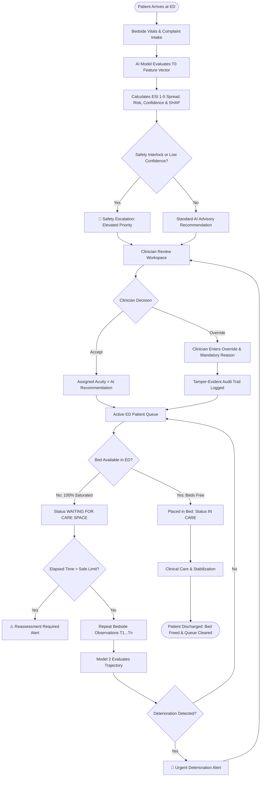

# PatientTriage.ai

### AI-Powered Emergency Department Triage & Clinical Decision Support

[](https://fastapi.tiangolo.com)
[](https://react.dev/)
[](https://vitejs.dev/)
[](https://scikit-learn.org/)
[](https://tailwindcss.com/)
[]()

---

> **Clinical Decision Support Notice**  
> PatientTriage.ai is an intelligent clinical decision-support (CDS) platform engineered to assist qualified emergency healthcare professionals. It does **not** make autonomous medical diagnoses, issue definitive triage mandates, or replace the clinical judgment, physical examination, or diagnostic decisions of licensed emergency physicians or triage nurses. All AI predictions, risk scores, and alert flags are strictly advisory and require human-in-the-loop oversight.

---

## Overview

**PatientTriage.ai** is an emergency department operations and clinical intelligence platform that pairs machine learning risk stratification with continuous physiological monitoring. Built for high-volume, resource-constrained hospital emergency rooms, the platform assists triage nurses and attending physicians in managing the intake bottleneck, prioritizing care by genuine medical acuity, and preventing unmonitored waiting room decompensation.

Modern emergency departments face severe operational gridlock, unpredictable patient surges, and presentations that range from mild trauma to catastrophic occult shock. PatientTriage.ai tackles these challenges at point of intake ($T_0$) by computing calibrated 5-level Emergency Severity Index (ESI) probability distributions, deriving physiological stress biomarkers, quantifying predictive uncertainty, and generating real-time SHAP factor attributions.

Beyond intake, the system continuously tracks serial bedside observations ($T_0 \to T_1 \to \dots \to T_n$). A dedicated longitudinal deterioration model evaluates rates of change in vital signs—such as expanding shock index, silent hypoxemia, and blunted febrile responses—alerting clinical staff to impending physiological collapse before it becomes irreversible. Real-time capacity intelligence automatically allocates patients to appropriate care spaces (Resuscitation, ICU, Acute, and Fast Track) and flags genuine bed saturation only when capacity is exhausted.

Every recommendation is transparent, explainable, and accountable: attending clinicians have full authority to override AI suggestions with mandatory documented justifications, while a tamper-evident audit trail preserves every interaction for hospital compliance.

---

## The Clinical Challenge

Emergency departments operate in high-friction environments characterized by uncertainty and time pressure:

- **Volume & Resource Constraints**: Rising patient visits collide with limited physical beds and nursing ratios, leading to dangerous waiting room delays.
- **High Presentation Heterogeneity**: Patients present with diverse complaints spanning multiple organ systems, often obscuring acute life-threats behind non-specific symptoms.
- **Imperfect Intake Information**: Triage nurses must categorize patients within two minutes using limited intake data, missing prior history, or unmeasured vitals.
- **Ambiguous & Discordant Presentations**: Patients may report severe distress despite normal vital signs (e.g., early acute coronary syndrome), or present with mild malaise while in severe occult shock (common in elderly and immunocompromised patients).
- **Age-Dependent Baseline Shifts**: Pediatric and geriatric vital signs differ substantially from healthy adult baselines; static diagnostic thresholds risk critical under-triage in vulnerable demographics.
- **Silent Waiting Room Deterioration**: High-risk patients frequently decompensate while waiting for an available care space, turning treatable conditions into intensive care admissions.
- **Clinician Cognitive Burden & Accountability**: High cognitive loads create diagnostic variability between clinicians. Teams need clear, advisory decision support that respects clinical autonomy and provides full auditability.

---

## Key Objectives

- **Standardized Intake Risk Stratification**: Deliver rapid, calibrated ESI acuity predictions at intake ($T_0$) to reduce triage subjectivity.
- **Safety-First Acuity Escalation**: Prevent under-triage through deterministic clinical safety interlocks and conservative probability calibration.
- **Transparent Uncertainty Quantification**: Clearly differentiate high-confidence assessments from uncertain cases triggered by missing data or ambiguous presentations.
- **Point-of-Care Explainability**: Surface the exact physiological factors and biomarkers that influenced the model's recommendations using SHAP.
- **Continuous Deterioration Surveillance**: Analyze longitudinal bedside vital trends to detect early sepsis, respiratory fatigue, and cardiovascular collapse.
- **Dynamic Capacity Management**: Map active patients to available physical care spaces and signal waiting states only when capacity is truly saturated.
- **Clinician-in-the-Loop Governance**: Keep clinicians in complete command with seamless review, override capabilities, and documented justifications.
- **Immutable Clinical Audit Logging**: Maintain a cryptographically tracked, role-governed audit trail across the entire patient journey.
- **Surge-Resilient ED Operations**: Ensure clinical stability and prioritization during multi-casualty or volume surges without artificial down-triaging.
- **Scalable Hospital Multi-Tenancy**: Provide isolated facility configurations for small community EDs, suburban general hospitals, and large trauma centers.

---

## Core Capabilities

```
┌────────────────────────────────────────────────────────────────────────────────────────┐
│                               PATIENTTRIAGE.AI PLATFORM                                │
├─────────────────────────┬─────────────────────────┬────────────────────────────────────┤
│  Point-of-Care Intake   │  Predictive Intelligence │   Capacity & Governance            │
│  • Rapid Registration   │  • Calibrated ESI ML    │   • Acuity-Aware Bed Allocation    │
│  • Bedside Vitals Entry │  • Trajectory Alerts    │   • Clinician Override Workspace   │
│  • Negation Extraction  │  • SHAP Explainability  │   • Tamper-Evident Audit Logging   │
│  • Age Cohort Grouping  │  • Multi-Tier Confidence│   • 3× ED Surge Simulation         │
└─────────────────────────┴─────────────────────────┴────────────────────────────────────┘
```

### Patient Intake & Registration
- **Demographics & Identification**: Captures patient name, age, biological sex, arrival mode (Ambulance, Walk-in, Wheelchair), and automatically provisions facility-scoped MRNs and Encounter IDs.
- **Chief Complaint & Clinical Negation Parsing**: Extracts presenting complaints while filtering clinical negations (*"denies chest pain"*, *"no dyspnea"*), preventing denied symptoms from inflating cardiac or respiratory acuity.
- **Bedside Vital Signs Capture**: Records Heart Rate (HR), Systolic Blood Pressure (SBP), Diastolic Blood Pressure (DBP), Respiratory Rate (RR), Oxygen Saturation ($\text{SpO}_2$), Body Temperature, Glasgow Coma Scale (GCS), and Pain Score (0–10).
- **History & Allergies Differentiation**: Categorizes medical history into *History Documented*, *Partial History*, or *Zero Prior History / First Visit*, ensuring absent history is never treated as a verified healthy baseline.

### AI & Machine Learning Triage
- **Calibrated Multi-Class Probability**: Produces calibrated discrete probabilities across all five ESI levels $[P(\text{ESI}_1), P(\text{ESI}_2), P(\text{ESI}_3), P(\text{ESI}_4), P(\text{ESI}_5)]$ strictly summing to $1.0$.
- **Acuity Stratification**: Maps risk probabilities to standard Emergency Severity Index levels:
  - **ESI 1**: *Critical — Immediate Care (Resuscitation)*
  - **ESI 2**: *Emergency — Immediate Assessment*
  - **ESI 3**: *Urgent — Prompt Assessment*
  - **ESI 4**: *Less Urgent*
  - **ESI 5**: *Non-Urgent*
- **Biomarker Synthesis**: Computes real-time physiological indicators including Shock Index ($\text{HR}/\text{SBP}$), Modified Shock Index, Pulse Pressure, Mean Arterial Pressure (MAP), quick SOFA (qSOFA), and Modified Early Warning Score (MEWS).
- **Multi-Tier Confidence**: Classifies predictions into **HIGH**, **MODERATE**, or **LOW** confidence based on normalized Shannon entropy, boundary margin, and data missingness.
- **Inline Explainability Drawer**: Displays positive and negative physiological feature weights directly within each patient card on the dashboard.

### Active ED Queue Management
- **Acuity-Sorted Queue**: Ranks active patients dynamically by clinical severity, physiological deterioration risk, and elapsed wait time.
- **Smart Filtering**: One-click views for *All Active*, *Waiting*, *In Care*, *Reassessment Required*, *High Priority (ESI 1-2)*, *Critical (ESI 1)*, and *Discharged*.
- **Safe Wait-Time Surveillance**: Tracks wait duration against established ESI safety limits (ESI 1: 0m, ESI 2: 15m, ESI 3: 45m, ESI 4: 90m, ESI 5: 120m).
- **Automated Reassessment Alerts**: Highlights overdue patients with amber warning prompts when safe wait windows expire.

### Clinician Review & Override
- **Advisory Clinical Workflow**: AI outputs are framed as advisory recommendations; they never finalize clinical status autonomously.
- **Physician Review Workspace**: Dedicated interface for emergency physicians to review intake vitals, probability spreads, and SHAP attributions before signing off on clinical decisions.
- **Immutable Override Tracking**: When an attending clinician overrides a triage level (e.g., modifying an AI-suggested ESI 2 to ESI 3), the original AI recommendation remains permanently preserved alongside the clinician's decision and mandatory clinical rationale.

### Full Patient Lifecycle
- **Care Progression**:
  $$\text{Intake} \longrightarrow \text{Care Space Placement (In Care)} \longrightarrow \text{Clinical Care} \longrightarrow \text{Discharge / Disposition}$$
- **Discharge Mechanics**: Discharging a patient releases their assigned care space, resolves active clinical alerts, and removes them from active queue views while preserving all longitudinal records for hospital compliance.

### Capacity & Care Space Allocation
- **Structured Bed Mapping**: Models real emergency department operational zones:
  - **Resuscitation Bays (`RESUS-01`, `RESUS-02`)**: Equipped for ESI 1 resuscitation.
  - **Critical Care / ICU Bays (`ICU-01`, `ICU-02`)**: ESI 2 emergent and deteriorating cases.
  - **Acute Care Beds (`BED-01` to `BED-17`)**: ESI 2–4 urgent presentations.
  - **Fast Track Chairs/Beds (`FT-01` to `FT-04`)**: ESI 4–5 ambulatory patients.
- **Automated Bed Allocation**: As long as beds are available, active patients are assigned appropriate care spaces and placed in `IN_TREATMENT` (**"IN CARE"**).
- **Capacity-Saturated Waiting**: Patients only enter the `WAITING` status (`"WAITING FOR AVAILABLE CARE SPACE"`) when all hospital beds are genuinely occupied.
- **Bed Turnover**: Discharging a patient immediately admits the highest-priority waiting patient into the vacated bed.

### Surge Operations
- **Simulated 3× Surge Mode**: Emulates disaster influxes or mass-casualty events by tripling incoming patient arrival rates.
- **Dynamic Surge Queue Prioritization**: Automatically surfaces unstable (`ESCALATE`) and overdue (`REASSESS`) patients to the top of the queue.
- **Strict Acuity Preservation**: Enforces that clinical acuity is never artificially downgraded to manufacture bed availability during surge conditions.

### Audit Trail & Governance
- **Chronological Event Logging**: Every registration, vital entry, observation correction, AI inference, alert generation, physician override, and discharge generates an immutable audit record.
- **Privacy Protection**: Automatically sanitizes passwords, session tokens, and unnecessary personal data from audit payloads.
- **Role-Based Audit Access**: Restricts compliance log views to authorized Clinical Directors and Hospital Administrators.

### Role-Based Access Control (RBAC) & Security
- **Multi-Tenant Facility Isolation**: Enforces facility-level tenancy (`hospital_id`), guaranteeing that staff from Hospital A cannot access records or patient queues from Hospital B.
- **5 Staff Roles**:
  - `HOSPITAL_ADMIN`: Facility configuration, staff provisioning, audit inspection.
  - `CLINICAL_DIRECTOR`: Clinical protocol management, surge mode activation.
  - `EMERGENCY_PHYSICIAN`: Physician review workspace, AI overrides, diagnostic orders, patient discharge.
  - `TRIAGE_NURSE`: Patient intake, bedside vital entry, observation corrections, alert acknowledgment.
  - `EMERGENCY_TECHNICIAN`: Vital signs capture, patient transport, supportive care.
- **Password Security**: PBKDF2-HMAC-SHA256 password hashing with 100,000 iterations and unique cryptographic salts.
- **Brute Force Defense**: In-memory sliding window rate limiter blocking accounts exceeding 5 failed login attempts per minute (HTTP 429).

---

## System Architecture & ML Engines

PatientTriage.ai employs two complementary machine learning engines operating across distinct phases of the emergency encounter:


### Model Architecture Comparison

| Dimension | Model 1: Arrival Triage Classifier | Model 2: Longitudinal Deterioration Detector |
| :--- | :--- | :--- |
| **Temporal Scope** | Intake Point of Presentation ($T_0$ only) | Serial Bedside Observations ($T_0 \to T_1 \dots T_n$) |
| **Feature Space** | 37 Intake Features (Vitals, Demographics, Negated Chief Complaint) | 48 Trajectory Features (Deltas, Velocities, Slopes, Rolling Vitals) |
| **Prediction Target** | 5-Level ESI Acuity Distribution ($P(\text{ESI}_1) \dots P(\text{ESI}_5)$) | 24-Hour Composite Critical Outcome (ICU, Intubation, Mortality) |
| **Primary Algorithm** | Multi-Class Calibrated Classifier (v1.1) | Calibrated Logistic Regression with Sigmoid Scaling (v1.0) |
| **Safety Interlocks** | Catastrophic Vitals Override ($\text{SpO}_2 < 85\%$, $\text{SBP} < 70$) | Severe Shock Index ($\ge 1.3$) & Rapid Desaturation Alerts |

---

## Machine Learning Pipeline

The project contains a clinical machine learning pipeline located in [`ml_pipeline/`](file:///c:/Users/aksha/Downloads/PatientTriage-AI/ml_pipeline):

```
ml_pipeline/
├── data_quality_engine.py           # Vitals range validation, missingness tracking, negation
├── age_reference_provider.py        # Pediatric, adult, and geriatric vital reference ranges
├── arrival_feature_extractor.py     # 37-dimensional T0 arrival feature vector builder
├── arrival_preprocessor.py          # Scaling, imputation, and categorical encoding
├── train_arrival_triage_model.py    # Training, hyperparameter tuning, and probability calibration
├── arrival_inference_engine.py      # Production inference wrapper with confidence & uncertainty
├── longitudinal_feature_extractor.py# 48-dimensional temporal trajectory feature builder
├── train_longitudinal_deterioration_model.py # Longitudinal model training pipeline
├── deterioration_inference_engine.py# Trajectory inference engine for serial vitals
├── explainability_engine.py         # SHAP Tree/Linear factor attribution engine
└── mlops_service.py                 # Model registry, data drift tracking, and dataset versioning
```

### Engineering Workflow
1. **Biological Range Validation** ([`data_quality_engine.py`](file:///c:/Users/aksha/Downloads/PatientTriage-AI/ml_pipeline/data_quality_engine.py)): Rejects non-physiological entries ($\text{SpO}_2 > 100\%$, $\text{HR} > 300\text{ bpm}$) and tracks missing fields with explicit boolean indicator variables.
2. **Clinical Text Negation Filtering**: Uses clinical syntax rules to separate affirmed symptoms from negated symptoms (*"denies fever"*, *"no chest pain"*).
3. **Anti-Leakage Patient Grouping**: Partitions patient cohorts strictly by `patient_id` (70% Train, 15% Validation, 15% Test) to prevent data leakage across splits. Post-triage interventions, downstream diagnoses, and discharge times are strictly quarantined from features.
4. **Probability Calibration**: Employs `CalibratedClassifierCV(method="sigmoid", cv=5)` to align predicted probabilities with empirical risk.
5. **Model Registry & Metadata**: Models are serialized as `.joblib` binaries alongside JSON metadata capturing training hyperparameters, feature schemas, and validation metrics.

---

## Feature Engineering

### Active Feature Space

#### Model 1: Arrival Triage Classifier ($T_0$ — 37 Features)
- **Demographics (6)**: `age`, `age_pediatric` ($<18$), `age_adult` ($18-64$), `age_geriatric` ($\ge 65$), `gender_male`, `gender_female`.
- **Arrival Mode (4)**: `arrival_mode_walkin`, `arrival_mode_ambulance`, `arrival_mode_wheelchair`, `arrival_mode_other`.
- **Chief Complaint Categories with Negation (7)**: `complaint_chest_pain`, `complaint_respiratory`, `complaint_abdominal`, `complaint_neurological`, `complaint_trauma`, `complaint_infection_fever`, `complaint_other`.
- **Bedside Vital Signs (8)**: `hr`, `sbp`, `dbp`, `rr`, `spo2`, `temp`, `gcs`, `pain_score`.
- **Derived Physiological Biomarkers (5)**: `shock_index`, `modified_shock_index`, `pulse_pressure`, `qsofa_score`, `mews_score`.
- **Missingness Indicator Flags (4)**: `temp_was_missing`, `gcs_was_missing`, `dbp_was_missing`, `pain_was_missing`.
- **History & Allergy Flags (3)**: `has_known_history`, `is_zero_history`, `has_known_allergies`.

#### Model 2: Longitudinal Deterioration Detector ($T_0 \to T_n$ — 48 Features)
- **Current Observation ($T_n$)**: `hr`, `sbp`, `dbp`, `rr`, `spo2`, `temp`, `gcs`, `pain_score`.
- **Current Biomarkers ($T_n$)**: `shock_index`, `modified_shock_index`, `pulse_pressure`, `mean_arterial_pressure`, `qsofa_score`, `mews_score`.
- **Sequential 1-Step Deltas ($T_n - T_{n-1}$)**: `delta_hr`, `delta_spo2`, `delta_rr`, `delta_sbp`, `delta_dbp`, `delta_temp`, `delta_gcs`, `delta_shock_index`.
- **Per-Minute Velocities**: `velocity_hr`, `velocity_spo2`, `velocity_rr`, `velocity_sbp`, `velocity_shock_index`.
- **Cumulative Baseline Deltas ($T_n - T_0$)**: `baseline_hr_delta`, `baseline_spo2_delta`, `baseline_rr_delta`, `baseline_sbp_delta`.
- **Rolling Trajectory Statistics**: `rolling_min_spo2`, `rolling_max_hr`, `rolling_max_rr`, `rolling_min_sbp`, `rolling_mean_hr`, `rolling_mean_spo2`.
- **Trajectory Slopes**: `trajectory_slope_spo2`, `trajectory_slope_hr`, `trajectory_slope_rr`.
- **Clinical Context**: `observation_count`, `time_since_arrival_mins`, `minutes_since_prior_obs`, `initial_triage_level`, `is_pediatric`, `is_geriatric`, `age`, `gender_male`.

### Extended Biomarker Roadmap
- *Clinical NLP Embeddings*: Transformer-extracted representations from narrative nurse triage notes.
- *Point-of-Care Laboratory Biomarkers*: High-sensitivity Troponin-I, venous blood lactate, blood gas analysis ($\text{pH}$, $\text{pCO}_2$), and creatinine.
- *Continuous Waveform Photoplethysmography (PPG)*: Pulse rate variability and respiratory sinus arrhythmia telemetry.

---

## Datasets & Validation Cohorts

The platform was developed and evaluated using clinically calibrated synthetic patient cohorts designed to replicate real-world emergency medicine distributions:

| Dataset Partition | Filename | Records / Cohort Size | Clinical Target |
| :--- | :--- | :--- | :--- |
| **Arrival Triage (Train)** | `dataset_arrival_v1.0_train.csv` | 3,500 unique patients | 5-Level ESI Acuity (`1` to `5`) |
| **Arrival Triage (Validation)** | `dataset_arrival_v1.0_val.csv` | 750 unique patients | 5-Level ESI Acuity (`1` to `5`) |
| **Arrival Triage (Test)** | `dataset_arrival_v1.0_test.csv` | 750 unique patients | 5-Level ESI Acuity (`1` to `5`) |
| **Longitudinal Trajectory (All)** | `dataset_longitudinal_v1.0.csv` | 15,749 observation slices (4,500 patients) | Composite 24h Critical Outcome |
| **Clinical Demonstration Archetypes** | Synthetic Seeder (`/api/demo/seed`) | 20 Archetype Encounters | Clinical Challenge Scenarios |

*Note: The current prototype utilizes simulated development data. Performance metrics reflect testing on this cohort and must not be interpreted as prospective clinical trial results.*

---

## Benchmark Performance

### Model 1: Arrival Triage Classifier Evaluation (Held-Out Test Set, $N = 750$)

- **Test Accuracy**: **78.40%**
- **Under-Triage Rate (UTR)**: **2.00%** *(Critical safety metric: patients assigned lower acuity than true need)*
- **Severe Under-Triage Rate ($\ge 2$ levels)**: **0.67%**
- **Over-Triage Rate (OTR)**: **19.60%** *(Reflects safe clinical conservatism)*
- **Multi-Class Brier Score**: **0.2977**
- **Per-Class Sensitivity (Recall)**:
  - **ESI 1 (Resuscitation)**: **91.38%**
  - **ESI 3 (Urgent)**: **98.21%**
  - **ESI 4 (Less Urgent)**: **100.00%**

### Model 2: Longitudinal Deterioration Model Evaluation (Held-Out Test Set, $N = 2,388$ observation slices)

- **ROC-AUC**: **0.8847**
- **PR-AUC (Average Precision)**: **0.7985**
- **Sensitivity / Recall**: **81.49%**
- **Precision**: **81.65%**
- **False Negative Rate (FNR)**: **18.51%**
- **Brier Score (Calibration)**: **0.1255**
- **Overall Accuracy**: **84.09%**
- **Subgroup Sensitivity**:
  - Pediatric ($<18$ yrs): **96.15%** (ROC-AUC: 0.8066)
  - Geriatric ($\ge 65$ yrs): **85.99%** (ROC-AUC: 0.9076)
  - Adult ($18-64$ yrs): **79.85%** (ROC-AUC: 0.8808)

---

## Explainability & Interpretability (XAI)

PatientTriage.ai integrates **SHAP (SHapley Additive exPlanations)** via [`explainability_engine.py`](file:///c:/Users/aksha/Downloads/PatientTriage-AI/ml_pipeline/explainability_engine.py) to provide point-of-care interpretability:

```
               AI PREDICTED ACUITY: ESI 1 (CRITICAL)
               Confidence: HIGH (97%) · Entropy: 0.03
                                 │
         ┌───────────────────────┴───────────────────────┐
         ▼                                               ▼
[+ PUSHING TOWARD CRITICAL]                    [- PUSHING TOWARD STABLE]
• Shock Index = 1.48 (+0.41)                   • Age = 73 (Geriatric Baseline)
• SpO2 = 88% (+0.38)                           • Ambulatory Status (-0.05)
• SBP = 88 mmHg (+0.29)
• Respiratory Rate = 28 bpm (+0.22)
                                 │
                                 ▼
                     CLINICIAN EVALUATION WORKSPACE
               [Accept Priority]   [Override Priority]
```

*Note: SHAP values represent statistical feature attributions within the mathematical model's decision space, not biological causation.*

---

## Clinical Safety & Uncertainty Quantification

PatientTriage.ai implements a **Safety-First** clinical architecture ([`uncertainty_service.py`](file:///c:/Users/aksha/Downloads/PatientTriage-AI/backend/services/uncertainty_service.py) & [`safety_service.py`](file:///c:/Users/aksha/Downloads/PatientTriage-AI/backend/services/safety_service.py)):

1. **Normalized Entropy Metric**: Measures probability dispersion across the five acuity classes:
   $$H(P) = -\sum_{i=1}^5 p_i \log_5(p_i)$$
2. **Decision Margin**: Tracks the gap between the primary and secondary predicted classes ($p_{(1)} - p_{(2)}$).
3. **Missingness Penalty**: Adjusts confidence downward when critical bedside parameters are missing or imputed.
4. **Safety Escalation Trigger**: When confidence is **LOW** ($H \ge 0.60$ or margin $< 0.15$), the platform initiates an automated **Safety Escalation**, elevating monitoring frequency until reviewed by a physician.
5. **Deterministic Clinical Safety Nets**: Extreme vital signs ($\text{SpO}_2 < 85\%$, $\text{SBP} < 70\text{ mmHg}$, $\text{GCS} \le 8$, or $\text{Shock Index} \ge 1.3$) trigger immediate ESI 1 resuscitation recommendations regardless of statistical model outputs.

---

## Emergency Department Workflow



---

## Surge Operations & Dynamic Capacity

The platform includes an Emergency Surge Protocol ([`hospital_config_service.py`](file:///c:/Users/aksha/Downloads/PatientTriage-AI/backend/services/hospital_config_service.py)):

| Operational Parameter | Normal Mode | Surge Mode ($3\times$ Influx) |
| :--- | :--- | :--- |
| **Arrival Volume** | Baseline Volume (e.g., 25/day) | $3.0\times$ Scaled Volume (e.g., 75/day) |
| **Queue Prioritization** | Standard Acuity + Arrival Time | Dynamic Surge Ranking (`ESCALATE` & `REASSESS` elevated) |
| **Safe Wait Windows** | Standard (ESI 2: 15m, ESI 3: 45m) | Tightened by 20% to prevent unobserved waiting room collapse |
| **Fast Track Utilization** | Routine Ambulatory Care | Aggressive fast-tracking for ESI 4–5 to protect acute beds |
| **Acuity Integrity** | Fixed | **Strict Preservation: Zero artificial down-triaging permitted** |

---

## Hospital Scalability & Multi-Tenancy

Pre-configured hospital operational scale profiles:

```
┌─────────────────────────┬─────────────────────────┬─────────────────────────┐
│   SMALL COMMUNITY ED    │   MEDIUM SUBURBAN ED    │   LARGE TRAUMA CENTER   │
│   • 8 Beds              │   • 25 Beds             │   • 75 Beds             │
│   • 40 Visits / Day     │   • 200 Visits / Day    │   • 500 Visits / Day    │
│   • 30m Reassessment    │   • 45m Reassessment    │   • 60m Reassessment    │
└─────────────────────────┴─────────────────────────┴─────────────────────────┘
```

Scalability parameters (bed capacity, reassessment intervals, surge multipliers) can be configured dynamically through [`/api/hospital-config/scale`](file:///c:/Users/aksha/Downloads/PatientTriage-AI/backend/routers/hospital_config.py).

---

## Data Privacy, RBAC & Security Hardening

- **Multi-Tenant Facility Boundaries**: Enforces strict `hospital_id` tenancy. Clinicians from one facility cannot query, view, or modify encounters from another hospital.
- **Role-Based Access Control**: Route-level permission guards enforce least-privilege access across all five clinical roles.
- **Cryptographic Password Storage**: Passwords hashed with PBKDF2-HMAC-SHA256 using 100,000 iterations and per-user cryptographic salts.
- **Immutable Audit Trail**: Compliance logs reject `PUT` and `DELETE` requests at the router level.
- **Data Minimization**: AI inference endpoints consume only minimized clinical parameters, excluding names, contact details, and national IDs.
- **Security Headers Middleware**: Implements `X-Frame-Options: DENY`, `X-Content-Type-Options: nosniff`, and strict CORS origin filtering.

---

## Technology Stack

| Domain | Technology / Library | Version | Role in Repository |
| :--- | :--- | :--- | :--- |
| **Backend Framework** | FastAPI | `^0.115.0` | Asynchronous REST API, OpenAPI documentation, dependency injection |
| **ASGI Server** | Uvicorn | `^0.34.0` | Production ASGI web server |
| **Database ORM** | SQLAlchemy | `^2.0.30` | Relational ORM models, session management, multi-tenancy |
| **Data Validation** | Pydantic | `^2.10.0` | Request/response schema validation and type safety |
| **Machine Learning** | scikit-learn | `^1.4.0` | Multi-class classifiers, probability calibration, preprocessors |
| **Model Interpretability** | SHAP | `^0.44.0` | Tree and Linear Shapley value attribution calculations |
| **Numerical Processing**| NumPy & Pandas | `^2.2.0` | Feature matrix computation, rolling statistics, deltas |
| **Frontend Framework** | React | `^19.2.8` | Component-based reactive user interface |
| **Build & Tooling** | Vite | `^8.2.2` | Hot Module Replacement (HMR) and production bundling |
| **Styling** | Tailwind CSS | `^4.3.3` | Utility-first clinical dark-mode dashboard styling |
| **Iconography** | Lucide React | `^1.34.0` | Clinical UI icons |
| **Database** | SQLite | `3.x` | Embedded relational database (`triage_database.db`) |

---

## Repository Structure

```
PatientTriage-AI/
├── ai_engine/                         # Baseline prototype inference engine
│   └── triage_engine.py               # Single-patient triage predictor
├── backend/                           # FastAPI Clinical Backend
│   ├── main.py                        # Application entry point, CORS, router registration
│   ├── models.py                      # SQLAlchemy ORM models (Patients, Encounters, Staff, Audits)
│   ├── run_tests.py                   # Master test runner (50 clinical & security tests)
│   ├── requirements.txt               # Python package dependencies
│   ├── middleware/                    # Security headers middleware
│   ├── routers/                       # Modular API route controllers
│   │   ├── auth.py                    # Staff login, session verification, hospital registration
│   │   ├── encounters.py              # ED queue, clinical status, patient discharge
│   │   ├── patients.py                # Patient demographics registration
│   │   ├── physician.py               # Physician review workspace & AI override endpoint
│   │   ├── alerts.py                  # Clinical deterioration & wait breach alerts
│   │   ├── audit.py                   # Immutable audit log inspection
│   │   ├── hospital_config.py         # Capacity, bed layout, on-duty staff, surge toggling
│   │   └── demo.py                    # 20-Patient synthetic cohort seeder
│   ├── schemas/                       # Pydantic request/response validation schemas
│   └── services/                      # Clinical domain services
│       ├── bed_service.py             # Capacity-aware bed allocation & turnover management
│       ├── rbac.py                    # Role-based access control & session token management
│       ├── audit_service.py           # Tamper-resistant audit logging engine
│       ├── safety_service.py          # Safety-first escalation & discordance detection
│       ├── uncertainty_service.py     # Multi-dimensional entropy & confidence estimation
│       ├── hospital_config_service.py # Facility scale & surge mode configuration
│       └── deterioration_detector.py  # Trend detection for serial observations
├── frontend/                          # React 19 + Vite + Tailwind CSS v4 Dashboard
│   ├── src/
│   │   ├── App.jsx                    # Root application wrapper with ErrorBoundary
│   │   ├── context/AuthContext.jsx    # Authentication & facility session provider
│   │   └── components/
│   │       ├── DashboardView.jsx      # ED Live Overview, queue cards, metrics, inline SHAP
│   │       ├── EDQueueView.jsx        # Sortable clinical queue table
│   │       ├── HospitalCapacityView.jsx # Bed zone visualizer & on-duty staff roster
│   │       ├── PhysicianReviewWorkspace.jsx # Attending physician override interface
│   │       ├── AlertsDashboard.jsx    # Active clinical alerts management
│   │       ├── AuditLogView.jsx       # Tamper-evident audit trail browser
│   │       ├── PatientRegistrationModal.jsx # Intake modal with bedside vitals
│   │       ├── LoginPage.jsx          # Facility verification & staff login
│   │       └── common/ErrorBoundary.jsx # Clinical runtime error fallback screen
├── ml_pipeline/                       # Machine Learning Engineering Pipeline
│   ├── arrival_inference_engine.py    # Model 1: Calibrated arrival triage inference
│   ├── deterioration_inference_engine.py # Model 2: Longitudinal deterioration inference
│   ├── arrival_feature_extractor.py   # 37-dimensional T0 arrival feature engineering
│   ├── longitudinal_feature_extractor.py # 48-dimensional temporal trajectory features
│   ├── data_quality_engine.py         # Biological validation & clinical negation filtering
│   ├── explainability_engine.py       # SHAP Tree/Linear factor attribution engine
│   ├── models/                        # Serialized model artifacts (.joblib) & metadata (.json)
│   ├── MODEL_CARD_ARRIVAL_TRIAGE_v1.0.md # Model Card for Arrival Classifier
│   └── MODEL_CARD_DETERIORATION_v1.0.md  # Model Card for Deterioration Model
├── scripts/                           # Utility & showcase scripts
│   └── run_round2_master_demonstration.py # Master end-to-end prototype demonstration
├── ROUND2_ARCHITECTURE.md             # Clinical specifications & regulatory documentation
└── README.md                          # Project documentation
```

---

## Getting Started & Installation

### Prerequisites
- **Python**: Version `3.10` or higher
- **Node.js**: Version `18.0` or higher (Node `v22` recommended)
- **Git**

### 1. Clone Repository
```bash
git clone https://github.com/akshayaboda17/PatientTriage-AI.git
cd PatientTriage-AI
```

### 2. Backend Setup
```bash
cd backend
python -m venv venv

# Windows PowerShell:
.\venv\Scripts\Activate.ps1
# Linux / macOS:
# source venv/bin/activate

pip install -r requirements.txt
```

### 3. Frontend Setup
```bash
cd ../frontend
npm install
```

---

## Environment Configuration

PatientTriage.ai operates locally with zero external cloud dependencies. For custom server setups, configure the following options:

```ini
# Backend Configuration
PORT=8000
HOST=127.0.0.1
ENVIRONMENT=development

# Database Connection (defaults to sqlite:///triage_database.db)
DATABASE_URL=sqlite:///triage_database.db

# CORS Allowed Origins
CORS_ORIGINS=http://localhost:5173,http://127.0.0.1:5173

# Frontend API Target (frontend/.env)
VITE_API_BASE_URL=http://localhost:8000
```

---

## Running the System

### Standard Launch

**Terminal 1: FastAPI Backend**
```bash
cd backend
python -m uvicorn main:app --reload --port 8000
```
- API Base: `http://localhost:8000`
- Swagger Docs: `http://localhost:8000/docs`

**Terminal 2: Vite React Frontend**
```bash
cd frontend
npm run dev
```
- Web Application: `http://localhost:5173`

### CLI Showcase Script
To run an automated test across all clinical features without opening a browser:
```bash
python scripts/run_round2_master_demonstration.py
```

---

## Interactive Demo Walkthrough

1. **Staff Sign-In**:
   - Navigate to `http://localhost:5173/`.
   - Enter Hospital Code: `DEMO001` (Demo General Hospital).
   - Select Role: `Emergency Physician` (`DOC001` — Dr. Gregory House, MD).
   - Click **Access Clinical System**.
2. **ED Live Overview**:
   - Observe key operational indicators: Active Patients (17 in care, 0 waiting), Available Beds (8 / 25), and Acuity Breakdown.
3. **Care Space Allocation**:
   - Inspect the patient queue: Resuscitation cases (`Patricia Dubois`, ESI 1) are placed in Resuscitation Bays (`RESUS-01`), while deteriorating cases (`Nathaniel Reed`, ESI 1) occupy ICU Bays (`ICU-01`).
4. **SHAP Factor Explainability**:
   - Click the **Why AI Recommended** button on Patricia Dubois's card.
   - Review physiological contributors (Shock Index = 1.48, $\text{SpO}_2$ = 88%) and model confidence (**HIGH 97%**).
5. **Deterioration Alerts**:
   - Observe active trajectory alerts: *"POSSIBLE DETERIORATION: Longitudinal vital signs indicate worsening physiological status"*.
6. **Simulated Patient Intake**:
   - Click **+ Add Patient** in the top navigation bar.
   - Enter complaint (*"Severe retrosternal chest pressure, denies shortness of breath"*).
   - Input vitals: HR 105, SBP 92, DBP 60, RR 22, $\text{SpO}_2$ 93%.
   - Submit assessment; note that clinical negation filtering prevents denied dyspnea from inflating respiratory risk.
7. **Physician Review & Override**:
   - Open the **Physician Review** workspace.
   - Select an encounter with an AI-recommended ESI 2.
   - Override the priority to ESI 3, providing a clinical rationale: *"Patient stable, normal ECG, pain resolved post-nitroglycerin"*.
   - Submit the decision; note that the original AI assessment remains immutably recorded.
8. **Compliance Audit Trail**:
   - Open **Audit Trail** from the navigation bar.
   - Verify the `AI_RECOMMENDATION_OVERRIDDEN` event showing timestamp, clinician ID (`DOC001`), and zero PII leakage.
9. **Capacity & Bed Turnover**:
   - Open **Beds & Staff** view to inspect zone allocation.
   - Discharge a patient in `RESUS-01`; note that the bed is immediately released and the patient is archived from the active queue.

---

## Verification & Automated Test Suite

```bash
# Run the combined backend test suite
cd backend
python run_tests.py
```

### Test Suite Execution Summary (50 / 50 Passing)

```
=================================================================
PATIENTTRIAGE.AI TEST VERIFICATION SUITE
=================================================================
 TASK 9:  Longitudinal Deterioration & Trend Detection  [10 / 10 PASS]
 TASK 10: Physician Clinical Review & AI Override       [10 / 10 PASS]
 TASK 11: Tamper-Resistant Clinical Audit Trail         [10 / 10 PASS]
 TASK 13: Security, RBAC & Multi-Tenant Hardening       [20 / 20 PASS]
-----------------------------------------------------------------
 COMBINED TOTAL:                                        [50 / 50 PASS]
=================================================================
```

### Production Build Verification
```bash
cd frontend
npm run build
```
*Builds production bundles with zero errors (1,830 modules compiled).*

---

## Clinical Scope & Limitations

1. **Synthetic Training Data**: Models were trained on synthetically generated physiological trajectories calibrated to emergency medicine distributions. Clinical deployment requires training on validated institutional EHR data.
2. **Lexical Negation Parsing**: The current clinical text negation filter uses lexical rules rather than full transformer NLP (e.g., BioClinicalBERT). Complex conversational notes are better handled via structured vital inputs.
3. **Discrete Vital Sampling**: Observations are evaluated at discrete measurement epochs ($T_0, T_1, \dots$) rather than sub-second streaming waveforms.
4. **Local Database Default**: Defaults to SQLite for zero-configuration hackathon demonstration; production multi-facility scaling requires PostgreSQL.

---

## Roadmap & Future Enhancements

- [ ] **Prospective Multi-Center Trials**: Partnering with academic emergency centers to benchmark against de-identified MIMIC-IV-ED datasets.
- [ ] **HL7 / FHIR Interoperability**: Native FHIR `Observation`, `Encounter`, and `Condition` resource adapters for bidirectional EHR integration.
- [ ] **Transformer-Based Clinical NLP**: Fine-tuning lightweight ClinicalBioBERT for deep extraction of chief complaint nuance and medication history.
- [ ] **Streaming Telemetry Ingestion**: Direct integration with pulse oximeters and automated vital monitors for hands-free serial observation capture.
- [ ] **Automated Model Drift Monitoring**: Scheduled drift detection pipelines evaluating Kolmogorov-Smirnov statistics on intake vitals to trigger governed retraining.

---

<div align="center">
  <sub>PatientTriage.ai · Emergency Department Clinical Decision Support Platform</sub>
</div>
