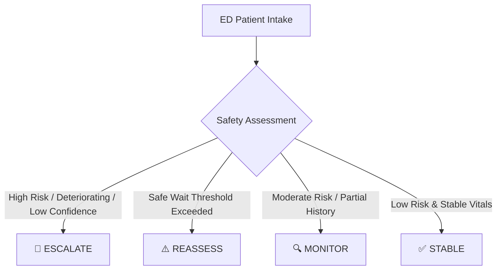

# PatientTriage.ai — Round 2 System Architecture & Clinical Documentation

## 1. System Overview

**PatientTriage.ai** is an Emergency Department (ED) clinical decision-support and continuous deterioration monitoring platform designed to assist emergency physicians and triage nurses in prioritizing intake, detecting early physiological decompensation, and navigating surge conditions safely.

> [!IMPORTANT]
> **Advisory Clinical Decision Support Disclaimer**:
> PatientTriage.ai is an advisory decision-support system. It produces probabilistic risk estimates and rule-based safety alerts to assist licensed clinicians. It **does NOT** provide automated medical diagnoses, autonomous triage level assignments, or replace the professional judgment of qualified healthcare personnel.

---

## 2. Age-Aware Clinical Triage (`AgeService`)

Physiological vitals (such as heart rate, respiratory rate, and blood pressure) vary significantly by developmental age cohort. The system categorizes patients into three explicit cohorts:

| Age Cohort | Age Range | Physiological Context | ML Applicability |
| :--- | :--- | :--- | :--- |
| **Pediatric** | $< 18$ years | Higher baseline HR/RR, lower baseline SBP. Rapid decompensation reserve. | Evaluated with safety disclaimer; adult-trained ML model incurs uncertainty penalty. |
| **Adult** | $18 - 64$ years | Standard baseline ranges (HR 60–100, RR 12–20, SBP 90–140). | Fully validated on primary development training cohort. |
| **Geriatric** | $\ge 65$ years | Blunted febrile response, baseline hypertension, polypharmacy blunting tachycardia. | Calibrated thresholds with high sensitivity to subtle vital deviations. |
| **Unknown** | `None` / Invalid | Safe fallback state. | Triggers mandatory safety escalation (`requires_safety_escalation = True`). |

---

## 3. Multidimensional Uncertainty & Confidence (`UncertaintyService`)

PatientTriage.ai explicitly separates statistical probability $P(Y=1)$ from model epistemic and aleatoric **confidence**:

$$\text{Composite Uncertainty} = (\text{Boundary Dist} \times 0.40) + \text{Missingness Penalty} + \text{Age Penalty} + \text{Discordance Penalty} + \text{History Penalty}$$

### Confidence Tiers

1. **HIGH Confidence**: Low composite uncertainty ($< 0.30$) with high data completeness ($< 25\%$ imputed features).
2. **MODERATE Confidence**: Mild uncertainty ($0.30 - 0.60$) or moderate feature imputation.
3. **LOW Confidence**: High uncertainty ($\ge 0.60$), decision boundary proximity ($p \approx 0.50$), heavy data missingness ($> 50\%$), or unknown age cohort. Triggers **Safety-First Escalation** and mandatory clinician review.

---

## 4. Safety-First Escalation Workflow (`SafetyService`)

The platform classifies every active ED encounter into one of four real-time safety workflow states:

- **ESCALATE**: Active deterioration alarm, high risk with low confidence, or critical pediatric/geriatric instability. Immediate clinician review required.
- **REASSESS**: Elapsed wait duration has breached the ESI safe wait threshold, or vitals have not been updated within the configured reassessment interval.
- **MONITOR**: Moderate risk or partial history requiring regular vital checks.
- **STABLE**: Normal vitals, low predicted risk, and within safe wait times.

---

## 5. Safe Wait-Time Thresholds & Scalability (`HospitalConfigService`)

### Standard Safe Wait Thresholds by ESI Acuity

| ESI Level | Acuity Category | Safe Wait Threshold (Minutes) | Escalation on Breach |
| :---: | :--- | :---: | :--- |
| **ESI 1** | Resuscitation | `0 min` (Immediate) | 🚨 Instant `REASSESSMENT REQUIRED` Alert |
| **ESI 2** | Emergent | `15 min` | 🚨 Critical Wait Breach Alarm |
| **ESI 3** | Urgent | `45 min` | ⚠️ Reassessment Prompt |
| **ESI 4** | Less Urgent | `90 min` | ⚠️ Monitoring Prompt |
| **ESI 5** | Non-Urgent | `120 min` | Standard Queue Review |

### Configurable Hospital Operational Scales

1. **Small Community ED**: 30 daily volume, 15 beds, 30 min reassessment cycle.
2. **Medium Regional ED**: 120 daily volume, 45 beds, 20 min reassessment cycle.
3. **Large Academic / Trauma Center**: 300 daily volume, 110 beds, 15 min reassessment cycle.

---

## 6. ED Surge Mode Protocol ($3\times$ Volume Influx)

When activated by a Clinical Director or Hospital Admin, **Surge Mode**:
1. Multiplies expected hourly arrival volume by $3.0\times$.
2. Activates surge-aware queue prioritization (elevating `ESCALATE` and `REASSESS` patients above standard order).
3. Heightens safe wait threshold alerts to prevent unattended waiting room decompensation.
4. Logs `SURGE_MODE_ACTIVATED` in the immutable audit trail with actor details.

---

## 7. Ambiguous & Discordant Presentations

The system detects clinical discordance between reported subjective symptoms and measured intake vitals:
- **Red Flags with Normal Vitals**: Severe crushing chest pain or neurological deficits with normotensive/eucardic vitals.
- **Silent Decompensation**: Vague mild complaints with abnormal vitals (hypotension, severe tachycardia, or desaturation).

Discordant cases are flagged with `⚠️ Discordant Presentation`, lowering model confidence and elevating safety review priority.

---

## 8. Synthetic 20-Patient Demonstration Cohort

The synthetic demonstration dataset (`/api/demo/seed`) provides 20 distinct clinical archetypes:
1. `PT-DEMO-001`: High-Risk Adult (Acute STEMI / Cardiogenic Sepsis)
2. `PT-DEMO-002`: Low-Risk Adult (Mild Ankle Sprain)
3. `PT-DEMO-003`: Moderate-Risk Adult (Acute Abdominal Pain)
4. `PT-DEMO-004`: Pediatric Case (10y Acute Asthma Exacerbation)
5. `PT-DEMO-005`: Geriatric Case (78y Urosepsis with AMS)
6. `PT-DEMO-006`: Ambiguous Presentation (Vague Malaise, Silent Hypotension)
7. `PT-DEMO-007`: Zero-History Patient (First Time ED Presentation)
8. `PT-DEMO-008`: Partial-History Patient (Fragmented Records)
9. `PT-DEMO-009`: Deteriorating Patient (Longitudinal SpO2 Drop & Tachycardia)
10. `PT-DEMO-010`: Stable Patient (Superficial Laceration)
11. `PT-DEMO-011`: Low-Confidence Prediction (Boundary Proximity $p=0.495$)
12. `PT-DEMO-012`: Discordant Presentation (10/10 Pain with Normal Vitals)
13. `PT-DEMO-013`: Physician Override Case (AI High $\to$ Clinician Moderate with Documented Justification)
14. `PT-DEMO-014`: Patient Exceeding Safe Wait Threshold (ESI 2 Waiting 36m $> 15$m limit)
15. `PT-DEMO-015`: Patient with Worsening Vitals (Escalating HR, Dropping SBP)
16. `PT-DEMO-016`: Surge-Mode Patient (Admitted during 3x Volume Influx)
17. `PT-DEMO-017`: Normal-Risk Adult (Upper Respiratory Infection)
18. `PT-DEMO-018`: Pediatric High Fever & Tachypnea (4y Febrile Illness)
19. `PT-DEMO-019`: Geriatric Syncope & CKD (82y Syncopal Episode)
20. `PT-DEMO-020`: Complex Mixed Presentation (Severe COPD + Decompensated Heart Failure)

---

## 9. Regulatory & Compliance Assumptions

- **HIPAA Privacy & Security**: Multi-tenant database isolation by `hospital_id`, RBAC enforcement on all routes, token revocation, rate-limiting, and zero PII leakage in audit logs.
- **US Hospital Operational Assumptions**: Compliant with standard Emergency Severity Index (ESI v4) 5-level triage frameworks and Emergency Department Early Warning System (ED-EWS) protocols.
